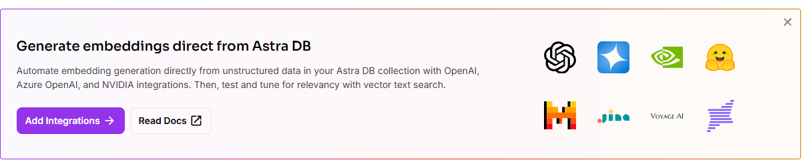
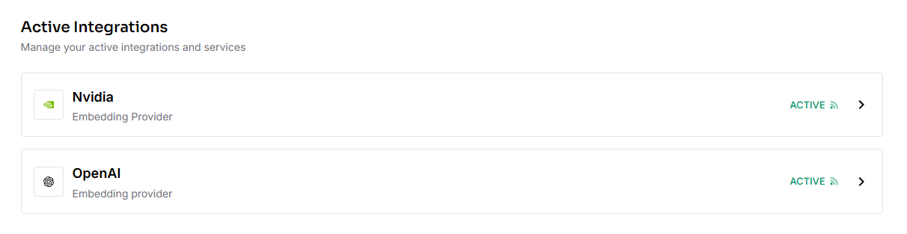

# Kinetic Constructs - A Workshop Base Company and Application

This repository provides a foundational product catalog web application designed as a starting point for workshops and building extensions, particularly using AI coding assistants like Cursor.

The application is a Product Catalog for a fake company called "Kinetic Constructs":

* The products and their documentation was built in Google AI Studio using the Google DeepMind [`gemini-2.5-pro-exp-03-25`](https://deepmind.google/technologies/gemini/pro/) model.
* All other scripts were built in Cursor using the same `gemini-2.5-pro-exp-03-25` model.
* Within Cursor, the Gemini model created prompts and code to call OpenAI's [DALL-E 3](https://openai.com/index/dall-e-3/) model.

In other words: **The Kinetic Constructs company, its products, documentation, images, and application are entirely AI-generated.**

## Getting Started

Follow these steps to set up the project environment.

### Prerequisites

*   **uv:** The Python package installer. Installation instructions: [https://github.com/astral-sh/uv#installation](https://github.com/astral-sh/uv#installation)
    * `uv` will install the appropriate version of Python (3.11) with a virtual environment within the project directory.
*   **Node.js:** Version 20 LTS is recommended. Download from [https://nodejs.org/](https://nodejs.org/).
*   **Astra DB:** A cloud-native Cassandra database. You'll need a free account and a database instance ([https://astra.datastax.com/](https://astra.datastax.com/)).

### Setup Steps

1.  **Clone the repository:**
    ```bash
    git clone https://github.com/AI-Phil/KineticConstructs.git
    cd KineticConstructs
    ```

2.  **Install Python Dependencies:**
    Use `uv` to install the required Python packages.
    ```bash
    uv sync
    ```

3.  **Install Node.js Dependencies:**
    ```bash
    npm install
    ```
    or
    ```bash
    yarn install
    ```

4.  **Configure Astra DB Connection:**
    *   Create a [Vector-Enabled DataStax Astra DB instance](https://www.datastax.com/products/datastax-astra) if you haven't already.
        *   
    *   Add the OpenAI Vector Integration:
        *   Navigate to your database's "Integrations" tab and click "Add Integration"
        *   
        *   Verify the integration is active:
        *   
    *   Find your Database's API Endpoint, and Generate an Application Token:
        *   
    *   Create a `.env` file in the root directory of the project.
    *   Add your Astra DB credentials to the `.env` file:
        ```dotenv
        ASTRA_DB_API_ENDPOINT="your_astra_db_api_endpoint"
        ASTRA_DB_TOKEN="your_astra_db_application_token"
        ASTRA_DB_INTEGRATION_OPENAI_KEY_NAME="api_key_name_from_integrations_page"
        ```
    *   Replace the placeholders with your actual API endpoint and token (the token should start with `AstraCS:...`), as well 
        as the integration name.

5.  **Load Data into Astra DB:**
    Run the provided Python scripts to populate your Astra DB collections.
    ```bash
    cd creation-assets
    uv run python load_products_astra.py
    uv run python load_documents_astra.py
    cd ..
    ```
    These scripts will create and populate the `products` and `documents` collections in your Astra DB based on the data in `creation-assets/products/`. Wait for both scripts to complete.

## Running the Basic Catalog Application

Once the setup is complete, you can run the basic Node.js web server:

```bash
node server.js
```

Open your web browser and navigate to `http://localhost:3000` (or the port specified in the console output). You should see the basic product catalog.

## Building Extensions & Contributing

This repository is intended as a base. Feel free to experiment and build new features!

Contribution guidelines and ideas for extensions will be detailed in a separate `CONTRIBUTING.md` file (to be created).

## License

This project is licensed under the MIT License - see the `LICENSE.md` file for details.

## Project Structure

*   `server.js`: The main application file (Express server, Astra DB connection, routing).
*   `views/`: Contains EJS template files.
    *   `products.ejs`: Template to display the product list.
*   `public/`: Contains static assets.
    *   `css/style.css`: Stylesheet for the application.
*   `products/`: Contains example data and images. Product images are served directly from here.
*   `.env`: Stores environment variables (Astra DB credentials). **(Not committed to Git)**
*   `.gitignore`: Specifies intentionally untracked files that Git should ignore.
*   `package.json`, `package-lock.json`: Node.js project configuration and dependency lock file.
