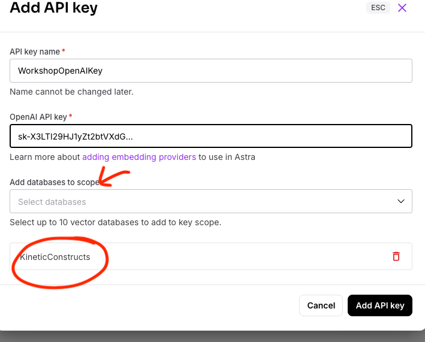

# 🧠 Modernize Your App with AI: A Hands-On Workshop

## 🎯 Workshop Goal

Ready to transform a standard web application into an AI-powered powerhouse? In this hands-on workshop, you'll learn how to leverage the cutting-edge capabilities of **DataStax Astra DB's vector search** and the intuitive **Langflow visual builder** to add sophisticated AI-driven search features to a Node.js product catalog application.

We'll start with a basic product catalog app and iteratively enhance its search functionality:
1.  Implement **keyword-based filtering** by category and tags using Astra DB's Data API.
2.  Introduce **semantic vector search** using `$vectorize` to find products based on meaning.
3.  Combine the best of both worlds with **hybrid search** using the `$hybrid` operator.
4. Implement **advanced hybrid search** with explicit **semantic and lexical** inputs.
5.  Abstract the complex search logic into a **Langflow flow** and call it via its API for ultimate flexibility.

By the end of this workshop, you'll have practical experience using serverless vector databases and low-code AI flow builders to create modern, intelligent applications. Let's get building!

## 🤖 Introducing the "Kinetic Constructs" Application

Before we dive into the technical setup and coding, let's get acquainted with the application we'll be enhancing throughout this workshop.

**Kinetic Constructs** is a fictional e-commerce platform specializing in innovative, interactive, and educational toys. The company prides itself on inspiring creativity, problem-solving, and collaborative play through products that blend physical construction with digital integration. Their catalog features diverse product lines such as ConstructoBots (programmable robots), LogicLeaps (electronic learning kits), ImagiWorlds (interactive playsets with AR), KinetiKits (advanced kinetic sets), and CreatiSpark (digital/electronic creative tools).

Here's a look at the application's homepage:


Currently, the application allows users to browse these products and apply basic filters (like category and tags). Our mission in this workshop is to supercharge its search capabilities, transforming it from a standard catalog into an intelligent discovery platform using Astra DB's vector search and Langflow.

## 🛠️ Prerequisites

This workshop assumes you have access to:
1.  A [GitHub account](https://github.com) (ensure it's set to public if you want to sign up for Astra DB via GitHub).

During the course, you'll gain access to the following by signing up for free:
1.  [DataStax Astra DB](https://astra.datastax.com): Our powerful, serverless vector database.
2.  [OpenAI account](https://platform.openai.com/signup): Needed for generating embeddings (we'll use their API).
    -   *Alternatively, workshop-specific OpenAI API keys might be provided if you encounter issues with your own.*

Follow the steps below and securely note down your **Astra DB API Endpoint**, **Astra DB Application Token**, and **OpenAI API Key**. We'll configure them shortly.

### 1. Sign up for Astra DB

Get your free-forever, serverless vector database:
*   Go to [astra.datastax.com](https://astra.datastax.com).
*   Sign up or log in (using GitHub is easy!).
*   Click `Databases` -> `Create Database`.
*   Select `Serverless (Vector)`, choose Amazon Web Services as Cloud Provider, choose us-east-2 as Region, and name your database (e.g., `KineticConstructs`).

    

*   Wait a few minutes for provisioning.
*   On the database dashboard, find and copy your **API Endpoint** (under Database details). Keep this safe!
*   Click `Generate Token`. Choose the "Database Administrator" role for simplicity in this workshop. **Immediately copy the Application Token** (it starts with `AstraCS:...`). This token is shown only once, so save it securely!

    

### 2. Sign up for OpenAI

We need OpenAI because our data loading scripts use it to generate the vector embeddings for product descriptions, and later, Astra DB's `$vectorize` feature will use this integration.
*   Create an [OpenAI account](https://platform.openai.com/signup) or [sign in](https://platform.openai.com/login).
*   Navigate to the [API key page](https://platform.openai.com/account/api-keys).
*   Click `+ Create new secret key`, optionally name it, and copy the generated **API Key**. Save it securely.
    -   *Alternatively, workshop-specific OpenAI API keys might be provided if you encounter issues with your own.*

    

### 3. Configure OpenAI Embedding Integration in Astra DB

For Astra DB to automatically generate embeddings (e.g., when using the `$vectorize` operator in searches later on), you need to configure an integration with your OpenAI account.

1.  **Navigate to Astra DB Integrations:**
    *   Go to your [Astra DB dashboard](https://astra.datastax.com).
    *   In the top navigation bar, click _settings_ **Settings**.
    *   Click on **Integrations** under your organization's settings.

2.  **Add OpenAI Embedding Provider:**
    *   Look for the **OpenAI** card under "Available Integrations" or "Embedding Providers."
    *   Click **Add Integration** on the OpenAI card.

3.  **Add API key:**
    *   You'll be prompted to add a **API key name:** Enter a descriptive name, for example, `WorkshopOpenAIKey`.
    *   **OpenAI API Key:** Paste the **API Key** you obtained from OpenAI in the previous step.
    *   You need to specify which of your databases can use it. Add your database to scope.
    *   Select your workshop database (e.g., `KineticConstructs` or the name you chose) from the list of available databases.
    *   Click **Add API key**.

    

By completing these steps, you've authorized your Astra DB instance to use your OpenAI account for embedding generation. This is crucial for some of the advanced search functionalities we'll explore.


### 4. ⚡️ Launch the Workshop Environment in GitHub Codespaces

Let's use GitHub Codespaces for a seamless development experience. It sets up everything you need in the cloud, including all dependencies from our pre-built Docker image.

1.  **Fork the Workshop Repository:** First, create your own copy (a "fork") of the workshop repository under your GitHub account. This will allow you to make changes and save your progress.
    *   Navigate to the main workshop repository page: [https://github.com/difli/KineticConstructs](https://github.com/difli/KineticConstructs).
    *   Click the `Fork` button (usually near the top right of the page).

    

2.  **Configure Your Fork:**
    *   On the "Create a new fork" page, your GitHub account should be pre-selected as the owner.
    *   **Important:** Keep the default `Repository name` as `KineticConstructs`. 
    *   Ensure `Copy the workshop branch only` is **UNCHECKED** if such an option appears (forking typically includes all branches by default, which is what we want).
    *   Click `Create fork`.

3.  **Navigate to Your Forked Repository:** After a few moments, you'll be taken to the main page of *your* forked repository (e.g., `https://github.com/YOUR_USERNAME/KineticConstructs`).

4.  **Switch to the `workshop` branch:** On your forked repository's page, use the branch selector dropdown (it might initially show `main` or another default branch) and select the `workshop` branch. This branch contains the starting point for our exercises.

     

5.  **Create Codespace on the `workshop` branch:**
    *   Ensure you are on the `workshop` branch of your forked repository.
    *   Click the green `<> Code` button, navigate to the `Codespaces` tab, and click `Create codespace on workshop`.

    

6.  **Patience is a Virtue:** Wait a few minutes while Codespaces pulls the pre-built Docker image and sets up your cloud-based development environment. Grab that coffee! ☕️

7.  **Configure Secrets:** Once the Codespace loads (you'll see VS Code in your browser), we need to provide the API keys and configuration names you saved or noted. The `postCreateCommand` in our devcontainer setup automatically copies `.env.example` to `.env` if `.env` doesn't exist.
    *   Find the `.env` file in the file explorer on the left (it should have been created automatically). If not, create it by copying `.env.example`.
    *   Edit `.env` and replace the placeholder values with your actual `OPENAI_API_KEY`, `ASTRA_DB_API_ENDPOINT`, `ASTRA_DB_APPLICATION_TOKEN`, and `ASTRA_DB_INTEGRATION_OPENAI_KEY_NAME`.
    *   **Important:** The `.gitignore` file is set up to prevent committing your `.env` file with secrets.

    Your `.env` file should look something like this (the paths for Langflow assume your repository is named `KineticConstructs` and is in the standard Codespaces workspace directory):
    ```dotenv
    # Astra DB Credentials - Required
    # Get these from your Astra DB database dashboard

    ASTRA_DB_API_ENDPOINT='YOUR_ASTRA_DB_API_ENDPOINT'
    ASTRA_DB_TOKEN='YOUR_ASTRA_DB_APPLICATION_TOKEN'
    ASTRA_DB_INTEGRATION_OPENAI_KEY_NAME='api_key_name_from_integrations_page'

    # Optional: Specify collection names if different from defaults
    # ASTRA_DB_PRODUCT_COLLECTION='products'
    # ASTRA_DB_DOCUMENT_COLLECTION='documents'

    OPENAI_API_KEY='YOUR_OPENAI_API_KEY'

    # Chatbot Configuration - comment in to for chatbot
    # Replace with your Langflow server details and credentials
    LANGFLOW_ENDPOINT='http://127.0.0.1:7860'
    #LANGFLOW_PRODUCT_ASSISTANT_FLOW_ID='YOUR_FLOW_ID'
    #LANGFLOW_API_KEY='YOUR_LANGFLOW_API_KEY'  # Optional, only required if your Langflow instance uses API key authentication 
    ```

8.  **Load Data into Astra DB:** Let's populate your database with sample product data. Open a terminal in your Codespace (Terminal -> New Terminal or Ctrl+`).
    ```bash
    cd creation-assets
    python load_products_astra.py
    python load_documents_astra.py
    cd ..
    ```
    These scripts use the credentials from your `.env` file to connect to Astra DB and create/populate the `products` and `documents` collections. Wait for both scripts to complete. You might see some output indicating the collections are being created and data is being loaded.

    

## 🚀 Running the Application (Initial State) & Understanding Basic Filtering (`server.js`)

With setup complete, let's run the Node.js web server. We'll start with `server.js`, which implements basic filtering. This will allow us to ensure the app structure works, you can see the product catalog, and understand its foundational search mechanism.

In the Codespace terminal:
```bash
node server.js
```
You should see output indicating the server is running, likely on port 3000. Codespaces should automatically detect this and show a pop-up allowing you to "Open in Browser". If not, navigate to the `PORTS` tab in the terminal panel, find port 3000, and click the globe icon (Open in Browser).

You should see the product catalog web page with search and filtering options. Try using the sidebar filters.


**How Basic Filtering Works (`server.js`):**
This initial version demonstrates basic product search using DataStax Astra DB's Data API. The code shows how to search our ConstructoBots, LogicLeaps, and other product lines using MongoDB-style queries. We use the `@datastax/astra-db-ts` client library. The `collection.find()` method accepts a `filter` object. We dynamically build this filter based on user selections for product family, type, and tags.

For example, if a user filters by:
*   The **CreatiSpark** family: The filter would be `{ family: "CreatiSpark" }`.
*   The tag **intermediate**: The filter would be `{ tags: { $all: ["intermediate"] } }`.
*   Both the **CreatiSpark** family AND the tag **intermediate** (as shown in the example screenshot): The `filterConditions` array would contain both conditions, leading to a combined filter: `{ $and: [{ family: "CreatiSpark" }, { tags: { $all: ["intermediate"] } }] }`.

**Code Highlights (`server.js` - `/search` route):**
```javascript
// Snippet from server.js /search route
const requestedFamily = req.query.family;
const requestedType = req.query.type;
let requestedTags = req.query.tag || [];
if (typeof requestedTags === 'string') requestedTags = [requestedTags];

const filterConditions = [];
if (requestedFamily) {
    const familyTypeFilter = { family: requestedFamily };
    if (requestedType) {
        familyTypeFilter.product_type = requestedType;
    }
    filterConditions.push(familyTypeFilter);
}
if (requestedTags.length > 0) {
    // Use $all to match products containing ALL selected tags
    filterConditions.push({ tags: { $all: requestedTags } });
}

let filter = {};
if (filterConditions.length > 1) {
    filter = { $and: filterConditions };
} else if (filterConditions.length === 1) {
    filter = filterConditions[0];
}

// For this basic version, the options object passed to find() is empty.
let options = {}; 
let products = [];

if (productCollection) { // Assuming productCollection is initialized
    try {
        console.log(`Querying products with filter: ${JSON.stringify(filter)} and options: ${JSON.stringify(options)}`);
        const cursor = await productCollection.find(filter, options);
        products = await cursor.toArray();
        console.log(`Fetched ${products.length} products.`);
    } catch (e) {
        console.error("Error fetching products:", e);
        // Handle error appropriately
    }
}
```

**Observe and Understand:**
With `server.js` running, use the sidebar filters for "Family", "Product Type", and "Tags". Observe how the product list updates. Check the terminal logs in Codespaces to see the `filter` object being constructed and logged. This shows you the direct translation of your UI selections into a database query.

🎉 **Congrats! You've run the initial application and seen how its basic filtering works.**

*(Press Ctrl+C in the terminal to stop the server before proceeding to the next steps).*\

## 📦 Workshop Follow-Along

### Iteration 1: Semantic Vector Search (`server_1.js` with `$vectorize`)

In this version, we enhance our search capabilities by adding vector search using Astra DB's `$vectorize` operator. The key change from `server.js` is the introduction of a `semanticQuery` based on user input, which is then used in the `options` for the `find` command via `options.sort = { $vectorize: semanticQuery }` if the query is present. This tells Astra DB to perform a semantic search.

**Code Highlights (`server_1.js` - `/search` route):**
```javascript
// Snippet from server_1.js /search route
const semanticQuery = req.query.q; // Text search query

// ... build filter object as in server.js ...

const options = {};
if (semanticQuery) {
    // This log appears if a semantic query is entered
    console.log(`Adding vector search options for: \"${semanticQuery}\"`);
    options.sort = { $vectorize: semanticQuery }; // Key change: Use $vectorize!
    options.limit = 25; // Limit results
    // options.includeSimilarity = true; // Optionally include similarity score
}

// The following console.log statements are part of the try block executing the search
console.log(`Querying products with filter: ${JSON.stringify(filter)} and options: ${JSON.stringify(options)}`);
const cursor = await productCollection.find(filter, options);
products = await cursor.toArray();
console.log(`Fetched ${products.length} products.`); // Reflects the actual number of products retrieved
```
The EJS template (`views/search.ejs`) is also updated to enable the semantic search input field by passing `semanticSearchEnabled: true`.

This means you can now:
*   Search semantically (e.g., "robot that can walk and balance").
*   Combine semantic search with filters (e.g., "python coding robot" in ConstructoBots).
*   The system falls back to regular filtered search when no query text is provided.

**Try it Out:**
Run the second iteration:
```bash
node server_1.js
```
Open the application. Use the main search box. Try searching for concepts like:
*   "playset for a 12 year old" (as shown in the example screenshot)
*   "robot that can be programmed"
*   "creative building toys for young children"
Notice how the results relate semantically to your query. You can also still combine these semantic searches with the category and tag filters.


Stop the server (Ctrl+C).

### Iteration 2: Hybrid Search (`server_2.js` with `$hybrid`)

In `server_2.js`, we enhance our search capabilities by implementing hybrid search. Compared to `server_1.js`, the main changes are:
1.  The `options.sort` now uses `{ $hybrid: semanticQuery }` instead of `$vectorize`.
2.  When a `semanticQuery` is provided, we now use the `productCollection.findAndRerank(filter, options.sort.$hybrid, options)` method, which combines semantic and keyword relevance. If no `semanticQuery` is present, it falls back to the standard `find` method.

**Code Highlights (`server_2.js` - `/search` route):**
```javascript
// Snippet from server_2.js /search route
const semanticQuery = req.query.q; // Text search query

// ... build filter object as before ...

const options = {};
if (semanticQuery) {
    console.log(`Adding hybrid search options for: \"${semanticQuery}\"`);
    options.sort = { $hybrid: semanticQuery }; // Key change: Use $hybrid!
    options.limit = 25;
}

console.log(`Querying products with filter: ${JSON.stringify(filter)} and options: ${JSON.stringify(options)}`);

let products = []; // Initialize products array
if (semanticQuery) {
    // Key change: Use findAndRerank for hybrid search
    // The findAndRerank method expects the query text (for $hybrid) as its second argument,
    // and an options object as its third.
    const cursor = await productCollection.findAndRerank(filter, options.sort.$hybrid, options);
    const rankedResults = await cursor.toArray(); // Array of RankedResult objects
    // Extract the original document from each result
    products = rankedResults.map(result => result.document);
    console.log(`findAndRerank returned ${products.length} results.`);
} else {
    // Fallback to regular find if no query text (filtering only)
    const cursor = await productCollection.find(filter, options);
    products = await cursor.toArray();
    console.log(`find returned ${products.length} results.`);
}
```
This enhancement means:
*   When users search with text (e.g., "python coding robot"), the system now considers both semantic similarity and keyword relevance.
*   Results are automatically reranked.
*   You can still combine this with filters.

**Try it Out:**
Run the third iteration:
```bash
node server_2.js
```
Open the application. With hybrid search, the system now considers both semantic meaning and keyword relevance for a single search query. Try searches like:
*   "playset for a 12 year old" (as shown in the example screenshot)
*   "programmable robot with wheels"
*   "beginner electronic kits for learning"
Observe how the results are reranked by Astra DB considering both aspects. You can still combine this with the category and tag filters.


Stop the server (Ctrl+C).

### Iteration 3: Advanced Hybrid Search with Explicit Keywords (`server_3.js`)

In `server_3.js`, we provide more granular control by allowing separate inputs for semantic and keyword searches. The main changes from `server_2.js` are:
1.  A new `keywordQuery` is captured from `req.query.keyword`.
2.  The logic for `options.sort` is expanded:
    *   If both `semanticQuery` and `keywordQuery` exist, `options.sort` is set to `{ $hybrid: { $vectorize: semanticQuery, $lexical: keywordQuery } }`. The `productCollection.findAndRerank(filter, options.sort.$hybrid, options)` method is then used with this detailed hybrid object.
    *   If only `semanticQuery` is present, `options.sort` becomes `{ $vectorize: semanticQuery }` (note: this is a pure vector search, differing from `server_2.js` which would have used `$hybrid` for a single query term), and `productCollection.find(filter, options)` is used.
    *   If only `keywordQuery` is present, the example primarily relies on the standard filtering mechanism, though it notes how one might integrate it further (e.g., via `$text` search if a text index exists).

**Code Highlights (`server_3.js` - `/search` route):**
```javascript
// Snippet from server_3.js /search route
const semanticQuery = req.query.q;          // Semantic query
const keywordQuery = req.query.keyword; // Explicit keyword query

// ... build filter object as before ...

const options = { limit: 25 }; // Default limit
let performHybridSearch = false;
let performVectorSearch = false;

if (semanticQuery) {
    if (keywordQuery) {
        // Both semantic and keyword queries provided
        options.sort = { $hybrid: { $vectorize: semanticQuery, $lexical: keywordQuery } };
        performHybridSearch = true;
        console.log(`Adding ADVANCED hybrid search options: vectorize=\"${semanticQuery}\", lexical=\"${keywordQuery}\"`);
    } else {
        // Only semantic query provided
        options.sort = { $vectorize: semanticQuery };
        performVectorSearch = true;
        console.log(`Adding vector search options for: \"${semanticQuery}\"`);
    }
} else if (keywordQuery) {
    // Only keyword query provided - This might be treated as a filter enhancement
    // or a specific lexical search if the backend/DB supports it standalone.
    console.log(`Keyword-only query: \"${keywordQuery}\" - will be used in filters or a simple text match if applicable.`);
    // Example of adding to filter: filterConditions.push({ "$text": { "$search": keywordQuery } }); (requires text index)
}

// ... (filter object construction) ...

console.log(`Querying products with filter: ${JSON.stringify(filter)} and options: ${JSON.stringify(options)}`);

let products = [];
if (performHybridSearch) {
    // Use findAndRerank for advanced hybrid search
    // The second argument to findAndRerank is the hybrid query object itself.
    const cursor = await productCollection.findAndRerank(filter, options.sort.$hybrid, options);
    const rankedResults = await cursor.toArray();
    products = rankedResults.map(result => result.document);
    console.log(`findAndRerank returned ${products.length} results.`);
} else if (performVectorSearch) {
    // Handles only $vectorize
    const cursor = await productCollection.find(filter, options);
    products = await cursor.toArray();
    console.log(`find (vector) returned ${products.length} results.`);
} else {
    // Handles filter-only search or keyword-only if not integrated into a sort strategy
    const cursor = await productCollection.find(filter, { limit: options.limit }); // Pass limit for consistency
    products = await cursor.toArray();
    console.log(`find (filter/keyword) returned ${products.length} results.`);
}
```
The EJS template (`views/search.ejs`) is updated to support two input fields (one for semantic, one for keywords) by passing `keywordSearchEnabled: true`.

This advanced implementation provides:
*   Independent control over semantic and keyword search components.
*   The ability to use semantic search alone, or combine it with explicit keywords.
*   More precise control over search results by combining different search strategies.

**Try it Out:**
Run this iteration:
```bash
node server_3.js
```
Open the application. You should now see two search boxes, allowing for more precise control over hybrid search:
*   In the first (top) search box, enter a semantic query like "playset for a 12 year old".
*   In the second (bottom) search box, enter a specific keyword to refine the search, such as "astronauts".
*   (As shown in the example screenshot, this would perform a hybrid search for "playset for a 12 year old" with an additional emphasis on the keyword "astronauts".)
*   Experiment by using only the semantic query, only the keyword query, or both. Observe how the `$hybrid` operator in Astra DB combines these, or how a pure `$vectorize` search (if only semantic query is used) behaves. You can also still use the category and tag filters in conjunction with these search inputs.


Stop the server (Ctrl+C).

## 🎉 Workshop Complete!

Congratulations! You've successfully modernized a Node.js application by integrating powerful AI search capabilities using DataStax Astra DB's Data API.

You've learned how to:
*   Set up Astra DB as a vector database and configure OpenAI integration for embedding generation.
*   Use the Astra DB Data API for:
    *   Basic keyword filtering.
    *   Semantic vector search with the `$vectorize` operator.
    *   Hybrid search combining keywords and vectors using the `$hybrid` operator and the `findAndRerank` method.
    *   Advanced hybrid search with separate explicit semantic and lexical inputs within the `$hybrid` operator.
*   Understand the concepts of vector embeddings and their role in semantic search.

This demonstrates how you can rapidly build and deploy sophisticated AI search features directly into your application using Astra DB.

**Next Steps:**
*   Dive deeper into the DataStax Astra DB Data API documentation to explore more advanced features and operators.
*   Experiment with different data models and indexing strategies in Astra DB to optimize for various search scenarios.
*   Consider how you might implement more complex query understanding or intent detection before forming your Data API queries.
*   Implement robust error handling and more detailed user feedback for the search interactions in your application.
*   Deploy your enhanced application!

Thanks for participating!