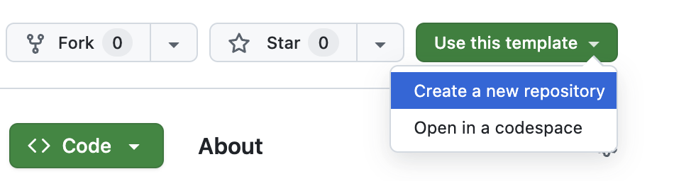

# 🧠 Modernize Your App with AI: A Hands-On Workshop 

## 🎯 Goal of the workshop
Learn how to ...

By the end of this workshop, you’ll have ... 

## 🛠️ Prerequisites
This workshop assumes you have access to:
1. [A Github account](https://github.com)

During the course, you'll gain access to the following by signing up for free:
1. [DataStax Astra DB](https://astra.datastax.com) (you can sign up through your **public** Github account)
2. [OpenAI account](https://platform.openai.com/signup) (you can sign up through your Github account)
    - *Alternatively we'll provide some OpenAI API keys to use for this workshop*

Follow the below steps and note down the **Astra DB API Endpoint**, **Astra DB ApplicationToken** and **OpenAI API Key** as we'll need them later on.

### Sign up for Astra DB
Make sure you have a vector-capable Astra database (get one for free at [astra.datastax.com](https://astra.datastax.com))
- Sign up or log in
- Click `Databases` and click `Create Database` 
- Select `Serverless (Vector)`, type a database name, i.e. `agentic-ai` and select a Cloud Provider and Region of choice

    

- Wait a few minutes for it to provision
- Note down the **API Endpoint** which can be found in the right pane underneath *Database details*.
- Click on `Generate Token` and give it a name, i.e. `agentic-ai-token` and click `Generate`. Now click on the copy button and paste the **Application Token** somewhere for later use

    

### Sign up for OpenAI
- Create an [OpenAI account](https://platform.openai.com/signup) or [sign in](https://platform.openai.com/login).
- Navigate to the [API key page](https://platform.openai.com/account/api-keys) and create a new **Secret Key**, optionally naming the key.
    - *Alternatively we'll provide some OpenAI API keys to use for this workshop*

    

### ⚡️ Open this tutorial on Github Codespaces
To make life easier, we'll use the awesome Github Codespace functionality. Github offers you a completely integrated developer experience and resources to get started quickly. How?

1. Open the [workshop repository](https://github.com/difli/KineticConstruct) repository
2. Click on `Use this template`->`Ceate new repository` as follows:

    

3. Now select your github account and name the new repository.  **ensure you select: Include all branches**. Ideally also set the description. Click `Create repository`

    

4. Cool! You just created a copy in your own Gihub account! Now let's switch to the **workshop** branch. Click `Create codespace on workshop` as follows:

    

5. Wait a few minutes and get a cup of coffee until your codespace is configured.

6. Configure the secrets as follows:

- Copy `.env.example` to `.env`
- Edit `.env` and provide the required variables `OPENAI_API_KEY`, `ASTRA_DB_API_ENDPOINT` and `ASTRA_DB_APPLICATION_TOKEN`

6. Now we can run Langflow as follows in the terminal window:

    ```bash
    uv run langflow run --env-file .env
    ```

    This starts Langflow and opens a port to your Codespace in the cloud. In case you loose track of the URL to Langflow, just click on `PORTS` in the terminal window.

🎉 Congrats! You finished the set-up part of the workshop. Now for the fun part!

## 📦 Workshop follow-along

### Search by Category and Tag

Use DataAPI to find products by their product category and/or tags on the products.

```bash
node server_0.js
```

### Search using Vectorize

Vector search does a semantic comparison between the search query and the product description.

```bash
node server_1.js
```

### Search with Hybrid Search

Hybrid search combines both semantic vector search along with a ranked keyword search of the product description.

```bash
node server_2.js
```
