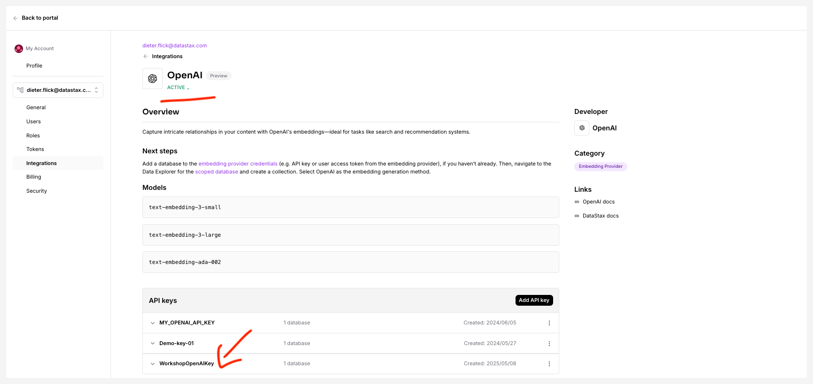
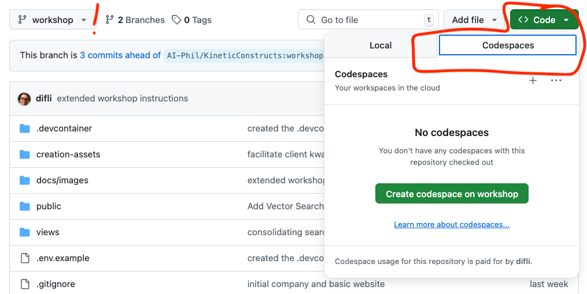
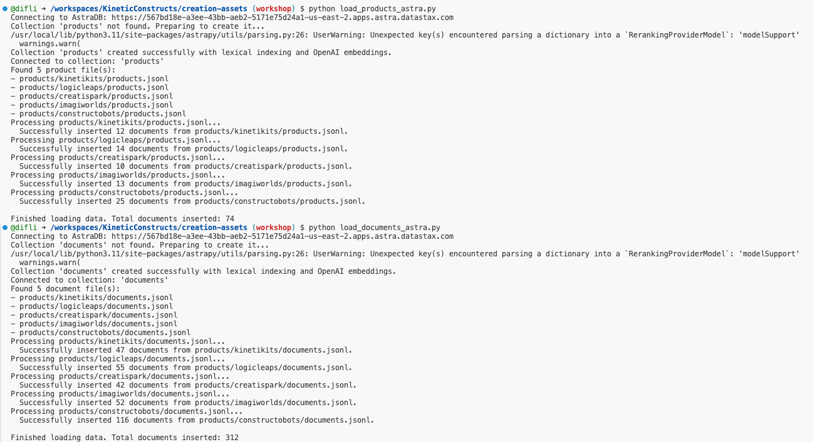

# 🧠 Modernize Your App with AI: A Hands-On Workshop

## 🎯 Workshop Goal

Ready to transform a standard web application into an AI-powered powerhouse? In this hands-on workshop, you'll learn how to leverage the cutting-edge capabilities of **DataStax Astra DB's vector search** and the intuitive **Langflow visual builder** to add sophisticated AI-driven search features to a Node.js product catalog application.

We'll start with a basic product catalog app and iteratively enhance its search functionality:
1.  Implement **keyword-based filtering** by category and tags using Astra DB's Data API.
2.  Introduce **semantic vector search** using `$vectorize` to find products based on meaning.
3.  Combine the best of both worlds with **hybrid search** using the `$hybrid` operator.
4. Implement **advanced hybrid search** with explicit **semantic and lexical** inputs.
5.  Abstract the complex search logic into a **Langflow flow** and call it via its API for ultimate flexibility.

By the end of this workshop, you'll have practical experience using serverless vector databases and low-code AI flow builders to create modern, intelligent applications. Let's get building!

## 🤖 Introducing the "Kinetic Constructs" Application

Before we dive into the technical setup and coding, let's get acquainted with the application we'll be enhancing throughout this workshop.

**Kinetic Constructs** is a fictional e-commerce platform specializing in innovative, interactive, and educational toys. The company prides itself on inspiring creativity, problem-solving, and collaborative play through products that blend physical construction with digital integration. Their catalog features diverse product lines such as ConstructoBots (programmable robots), LogicLeaps (electronic learning kits), ImagiWorlds (interactive playsets with AR), KinetiKits (advanced kinetic sets), and CreatiSpark (digital/electronic creative tools).

Here's a look at the application's homepage:


Currently, the application allows users to browse these products and apply basic filters (like category and tags). Our mission in this workshop is to supercharge its search capabilities, transforming it from a standard catalog into an intelligent discovery platform using Astra DB's vector search and Langflow.

## 🛠️ Prerequisites

This workshop assumes you have access to:
1.  A [GitHub account](https://github.com) (ensure it's set to public if you want to sign up for Astra DB via GitHub).

During the course, you'll gain access to the following by signing up for free:
1.  [DataStax Astra DB](https://astra.datastax.com): Our powerful, serverless vector database.
2.  [OpenAI account](https://platform.openai.com/signup): Needed for generating embeddings (we'll use their API).
    -   *Alternatively, workshop-specific OpenAI API keys might be provided if you encounter issues with your own.*

Follow the steps below and securely note down your **Astra DB API Endpoint**, **Astra DB Application Token**, and **OpenAI API Key**. We'll configure them shortly.

### 1. Sign up for Astra DB

Get your free-forever, serverless vector database:
*   Go to [astra.datastax.com](https://astra.datastax.com).
*   Sign up or log in (using GitHub is easy!).
*   Click `Databases` -> `Create Database`.
*   Select `Serverless (Vector)`, choose a Cloud Provider/Region, and name your database (e.g., `agentic-ai`).

    

*   Wait a few minutes for provisioning.
*   On the database dashboard, find and copy your **API Endpoint** (under Database details). Keep this safe!
*   Click `Generate Token`. Choose the "Database Administrator" role for simplicity in this workshop. **Immediately copy the Application Token** (it starts with `AstraCS:...`). This token is shown only once, so save it securely!

    

### 2. Sign up for OpenAI

We need OpenAI because our data loading scripts use it to generate the vector embeddings for product descriptions, and later, Astra DB's `$vectorize` feature will use this integration.
*   Create an [OpenAI account](https://platform.openai.com/signup) or [sign in](https://platform.openai.com/login).
*   Navigate to the [API key page](https://platform.openai.com/account/api-keys).
*   Click `+ Create new secret key`, optionally name it, and copy the generated **API Key**. Save it securely.
    -   *Alternatively, workshop-specific OpenAI API keys might be provided if you encounter issues with your own.*

    

### 3. Configure OpenAI Embedding Integration in Astra DB

For Astra DB to automatically generate embeddings (e.g., when using the `$vectorize` operator in searches later on), you need to configure an integration with your OpenAI account.

1.  **Navigate to Astra DB Integrations:**
    *   Go to your [Astra DB dashboard](https://astra.datastax.com).
    *   In the top navigation bar, click _settings_ **Settings**.
    *   In the **Settings** navigation menu on the left, ensure your active organization is selected (it usually is by default).
    *   Click on **Integrations** under your organization's settings.

2.  **Add OpenAI Embedding Provider:**
    *   Look for the **OpenAI** card under "Available Integrations" or "Embedding Providers."
    *   Click **Add Integration** or **Configure** on the OpenAI card.

3.  **Add Credential:**
    *   You'll be prompted to add a credential for this integration.
    *   **Credential Name:** Enter a descriptive name, for example, `WorkshopOpenAIKey`.
    *   **OpenAI API Key:** Paste the **API Key** you obtained from OpenAI in the previous step.
    *   **Model Name:** It's recommended to use `text-embedding-ada-002` for this workshop, as it's efficient and aligns with the embeddings our initial data load will use. Select this model if available in a dropdown, or enter it if it's a text field. (If newer small models like `text-embedding-3-small` are available and you prefer, ensure consistency with data loading).
    *   Click **Add Credential** (or a similar button like **Save** or **Validate & Add**).

4.  **Scope Credential to Database:**
    *   Once the credential is added, you need to specify which of your databases can use it.
    *   Find the credential you just created (e.g., `WorkshopOpenAIKey`) in the list of credentials for the OpenAI integration.
    *   Click on options like **Manage Scopes**, **Edit Scopes**, or **Add to Databases** associated with that credential.
    *   Select your workshop database (e.g., `agentic-ai` or the name you chose) from the list of available databases.
    *   Confirm or save the scope changes.

By completing these steps, you've authorized your Astra DB instance to use your OpenAI account for embedding generation. This is crucial for some of the advanced search functionalities we'll explore.



### 4. ⚡️ Launch the Workshop Environment in GitHub Codespaces

Let's use GitHub Codespaces for a seamless development experience. It sets up everything you need in the cloud, including all dependencies from our pre-built Docker image.

1.  **Fork the Workshop Repository:** First, create your own copy (a "fork") of the workshop repository under your GitHub account. This will allow you to make changes and save your progress.
    *   Navigate to the main workshop repository page: [https://github.com/difli/KineticConstructs](https://github.com/difli/KineticConstructs).
    *   Click the `Fork` button (usually near the top right of the page).

     *<- Placeholder: Add correct image path for Fork button*

2.  **Configure Your Fork:**
    *   On the "Create a new fork" page, your GitHub account should be pre-selected as the owner.
    *   **Important:** Keep the default `Repository name` as `KineticConstructs`. Changing this name will likely cause issues with the pre-configured paths for `node_modules` and Langflow settings in the Codespace environment.
    *   You can add an optional description.
    *   Ensure `Copy the workshop branch only` is **UNCHECKED** if such an option appears (forking typically includes all branches by default, which is what we want).
    *   Click `Create fork`.

     *<- Placeholder: Add correct image path for Fork options page*

3.  **Navigate to Your Forked Repository:** After a few moments, you'll be taken to the main page of *your* forked repository (e.g., `https://github.com/YOUR_USERNAME/KineticConstructs`).

4.  **Switch to the `workshop` branch:** On your forked repository's page, use the branch selector dropdown (it might initially show `main` or another default branch) and select the `workshop` branch. This branch contains the starting point for our exercises.

     *<- Placeholder: Add correct image path for switching branch*

5.  **Create Codespace on the `workshop` branch:**
    *   Ensure you are on the `workshop` branch of your forked repository.
    *   Click the green `<> Code` button, navigate to the `Codespaces` tab, and click `Create codespace on workshop`.

    

6.  **Patience is a Virtue:** Wait a few minutes while Codespaces pulls the pre-built Docker image and sets up your cloud-based development environment. Grab that coffee! ☕️

7.  **Configure Secrets:** Once the Codespace loads (you'll see VS Code in your browser), we need to provide the API keys and configuration names you saved or noted. The `postCreateCommand` in our devcontainer setup automatically copies `.env.example` to `.env` if `.env` doesn't exist.
    *   Find the `.env` file in the file explorer on the left (it should have been created automatically). If not, create it by copying `.env.example`.
    *   Edit `.env` and replace the placeholder values with your actual `OPENAI_API_KEY`, `ASTRA_DB_API_ENDPOINT`, `ASTRA_DB_APPLICATION_TOKEN`, and `ASTRA_DB_INTEGRATION_OPENAI_KEY_NAME`.
    *   **Important:** The `.gitignore` file is set up to prevent committing your `.env` file with secrets.

    Your `.env` file should look something like this (the paths for Langflow assume your repository is named `KineticConstructs` and is in the standard Codespaces workspace directory):
    ```dotenv
    # OpenAI Settings
    OPENAI_API_KEY="sk-..."

    # Astra DB Settings
    ASTRA_DB_API_ENDPOINT="https://YOUR_ENDPOINT.apps.astra.datastax.com"
    ASTRA_DB_APPLICATION_TOKEN="AstraCS:..."
    # This is the name you gave to your OpenAI API Key Credential in the Astra DB Integrations page
    # (e.g., WorkshopOpenAIKey, as suggested in Step 3.3)
    ASTRA_DB_INTEGRATION_OPENAI_KEY_NAME="api_key_name_from_integrations_page"

    # --- Langflow Configuration ---
    # Directory for logs, database, etc. Needs to be writable by the user running langflow.
    LANGFLOW_CONFIG_DIR="/workspaces/KineticConstructs/.langflow_config"

    # Specifies the database file location within the config dir
    # Note the four slashes for an absolute path with sqlite:///
    LANGFLOW_DATABASE_URL="sqlite:////workspaces/KineticConstructs/.langflow_config/langflow.db"

    # Explicitly set the log file path
    LANGFLOW_LOG_FILE="/workspaces/KineticConstructs/.langflow_config/langflow.log"
    ```

8.  **Load Data into Astra DB:** Let's populate your database with sample product data. Open a terminal in your Codespace (Terminal -> New Terminal or Ctrl+`).
    ```bash
    cd creation-assets
    python load_products_astra.py
    python load_documents_astra.py
    cd ..
    ```
    These scripts use the credentials from your `.env` file to connect to Astra DB and create/populate the `products` and `documents` collections. Wait for both scripts to complete. You might see some output indicating the collections are being created and data is being loaded.



## 🚀 Running the Application (Initial State) & Understanding Basic Filtering (`server.js`)

With setup complete, let's run the Node.js web server. We'll start with `server.js`, which implements basic filtering. This will allow us to ensure the app structure works, you can see the product catalog, and understand its foundational search mechanism.

In the Codespace terminal:
```bash
node server.js
```
You should see output indicating the server is running, likely on port 3000. Codespaces should automatically detect this and show a pop-up allowing you to "Open in Browser". If not, navigate to the `PORTS` tab in the terminal panel, find port 3000, and click the globe icon (Open in Browser).

You should see the product catalog web page with search and filtering options. Try using the sidebar filters.


**How Basic Filtering Works (`server.js`):**
This initial version demonstrates basic product search using DataStax Astra DB's Data API. The code shows how to search our ConstructoBots, LogicLeaps, and other product lines using MongoDB-style queries. We use the `@datastax/astra-db-ts` client library. The `collection.find()` method accepts a `filter` object. We dynamically build this filter based on user selections for product family, type, and tags.

For example:
*   All ConstructoBots wheeled robots: `{ family: "ConstructoBots", product_type: "Wheeled Robots" }`
*   Products with specific tags: `{ tags: { $all: ["coding", "python"] } }`
*   Combine both: `{ $and: [{ family: "ConstructoBots" }, { tags: { $all: ["coding", "python"] } }] }`

**Code Highlights (`server.js` - `/search` route):**
```javascript
// Snippet from server.js /search route
const requestedFamily = req.query.family;
const requestedType = req.query.type;
let requestedTags = req.query.tag || [];
if (typeof requestedTags === 'string') requestedTags = [requestedTags];

const filterConditions = [];
if (requestedFamily) {
    const familyTypeFilter = { family: requestedFamily };
    if (requestedType) {
        familyTypeFilter.product_type = requestedType;
    }
    filterConditions.push(familyTypeFilter);
}
if (requestedTags.length > 0) {
    // Use $all to match products containing ALL selected tags
    filterConditions.push({ tags: { $all: requestedTags } });
}

let filter = {};
if (filterConditions.length > 1) {
    filter = { $and: filterConditions }; // Combine multiple conditions
} else if (filterConditions.length === 1) {
    filter = filterConditions[0];
}

// For this basic version, options object is empty
let options = {}; 

console.log(`Querying products with filter: ${JSON.stringify(filter)}`);
const cursor = await productCollection.find(filter, options);
products = await cursor.toArray();
console.log(`find returned ${products.length} results.`);
```

**Observe and Understand:**
With `server.js` running, use the sidebar filters for "Family", "Product Type", and "Tags". Observe how the product list updates. Check the terminal logs in Codespaces to see the `filter` object being constructed and logged. This shows you the direct translation of your UI selections into a database query.

🎉 **Congrats! You've run the initial application and seen how its basic filtering works.**

*(Press Ctrl+C in the terminal to stop the server before proceeding to the next steps).*\

## 📦 Workshop Follow-Along

### Iteration 1: Semantic Vector Search (`server_1.js` with `$vectorize`)

In this version, we enhance our search capabilities by adding vector search using Astra DB's `$vectorize` operator. The beauty of this enhancement is that we don't need to modify our existing filter logic – we simply add vector search as an additional option when a text query is provided.

**How it Works:**
*   We leverage the `$vector` field (containing OpenAI embeddings of product descriptions) automatically generated by Astra DB or loaded during setup.
*   We use Astra DB's `$vectorize` operator within the `sort` option of the `find` command. This tells Astra DB to take the user's raw text query, convert it into a vector (using the OpenAI integration you configured for the collection), and find documents whose `$vector` is most similar.

**Code Highlights (`server_1.js` - `/search` route):**
```javascript
// Snippet from server_1.js /search route
const queryText = req.query.q; // Text search query

// ... build filter object as in server.js ...

const options = {};
if (queryText) {
    console.log(`Adding vector search options for: \"${queryText}\"`);
    options.sort = { $vectorize: queryText }; // Key change: Use $vectorize!
    options.limit = 25; // Limit results
    // options.includeSimilarity = true; // Optionally include similarity score
}

console.log(`Querying products with filter: ${JSON.stringify(filter)} and options: ${JSON.stringify(options)}`);
const cursor = await productCollection.find(filter, options);
products = await cursor.toArray();
```
The EJS template (`views/search.ejs`) is also updated to enable the semantic search input field by passing `semanticSearchEnabled: true`.

This means you can now:
*   Search semantically (e.g., "robot that can walk and balance").
*   Combine semantic search with filters (e.g., "python coding robot" in ConstructoBots).
*   The system falls back to regular filtered search when no query text is provided.

**Try it Out:**
Run the second iteration:
```bash
node server_1.js
```
Open the application. Use the main search box. Try searching for concepts:
*   "something warm for winter"
*   "stay dry in the rain"
*   "gear for climbing mountains"
Notice how the results relate semantically. Combine this with the filters.


Stop the server (Ctrl+C).

### Iteration 2: Hybrid Search (`server_2.js` with `$hybrid`)

In `server_2.js`, we enhance our search capabilities by implementing hybrid search, which combines both semantic vector search and lexical (keyword) search. This provides more accurate and relevant results by considering both semantic meaning and keyword matches.

**How it Works:**
*   Astra DB provides the `$hybrid` operator in the `sort` option.
*   The `@datastax/astra-db-ts` client offers a convenient `findAndRerank` method designed specifically for `$hybrid` search. This method returns results already ordered by the combined relevance score from both vector and keyword matching.

**Code Highlights (`server_2.js` - `/search` route):**
```javascript
// Snippet from server_2.js /search route
const queryText = req.query.q; // Text search query

// ... build filter object as before ...

const options = {};
if (queryText) {
    console.log(`Adding hybrid search options for: \"${queryText}\"`);
    options.sort = { $hybrid: queryText }; // Key change: Use $hybrid!
    options.limit = 25;
}

console.log(`Querying products with filter: ${JSON.stringify(filter)} and options: ${JSON.stringify(options)}`);

if (queryText) {
    // Key change: Use findAndRerank for hybrid search
    const cursor = await productCollection.findAndRerank(filter, options);
    const rankedResults = await cursor.toArray(); // Array of RankedResult objects
    // Extract the original document from each result
    products = rankedResults.map(result => result.document);
    console.log(`findAndRerank returned ${products.length} results.`);
} else {
    // Fallback to regular find if no query text (filtering only)
    const cursor = await productCollection.find(filter, options);
    products = await cursor.toArray();
    console.log(`find returned ${products.length} results.`);
}
```
This enhancement means:
*   When users search with text (e.g., "python coding robot"), the system now considers both semantic similarity and keyword relevance.
*   Results are automatically reranked.
*   You can still combine this with filters.

**Try it Out:**
Run the third iteration:
```bash
node server_2.js
```
Open the application. Try searches combining concepts and keywords:
*   "waterproof gore-tex hiking boots"
*   "lightweight tent for backpacking"
Compare the results to the pure vector search.


Stop the server (Ctrl+C).

### Iteration 3: Advanced Hybrid Search with Explicit Keywords (`server_3.js`)

In `server_3.js` (formerly `server_0.js`), we take hybrid search a step further by allowing users to specify both semantic and keyword search criteria independently. This gives users more control over how their search is performed.

**How it Works:**
The application now accepts two distinct query inputs: one for a semantic (vector) search and another for a lexical (keyword) search. Astra DB's Data API allows specifying these within the `$hybrid` operator.

**Code Highlights (`server_3.js` - `/search` route):**
```javascript
// Snippet from server_3.js /search route
const queryText = req.query.q;          // Semantic query
const keywordQuery = req.query.keyword; // Explicit keyword query

// ... build filter object as before ...

const options = {};
let performHybridSearch = false;

if (queryText) {
    if (keywordQuery) {
        // Both semantic and keyword queries provided
        options.sort = { $hybrid: { $vectorize: queryText, $lexical: keywordQuery } };
        performHybridSearch = true;
        console.log(`Adding ADVANCED hybrid search options: vectorize=\"${queryText}\", lexical=\"${keywordQuery}\"`);
    } else {
        // Only semantic query provided
        options.sort = { $vectorize: queryText };
        console.log(`Adding vector search (from server_3) options for: \"${queryText}\"`);
    }
    options.limit = 25;
} else if (keywordQuery) {
    // Only keyword query provided (Note: This case might need a specific $lexical standalone or be handled by regular text indexing if not using $hybrid)
    // For this example, we'll assume if keywords are provided, they are part of a hybrid search or a text search capability not shown in this snippet.
    // A pure keyword search without $vectorize might look different or require ensuring text fields are indexed for lexical search.
    // The example focuses on $hybrid or $vectorize when q is present.
    // To implement pure keyword search, you might use a filter on text fields, or a specific lexical search operator if available.
    // This snippet assumes `keywordQuery` is primarily for the `$lexical` part of `$hybrid`.
    // A simple approach for keyword-only might be to just use the filter if no `queryText`.
    // For robustness, this part needs careful consideration based on desired behavior for keyword-only searches.
    console.log(`Keyword-only query: \"${keywordQuery}\" - falling back to filter or simple text match (implementation specific)`);
    // Example: filter['$text'] = { '$search': keywordQuery }; (Requires text index)
    // For now, this path will likely just use the existing filter if no queryText.
}


console.log(`Querying products with filter: ${JSON.stringify(filter)} and options: ${JSON.stringify(options)}`);

if (performHybridSearch) {
    const cursor = await productCollection.findAndRerank(filter, options);
    const rankedResults = await cursor.toArray();
    products = rankedResults.map(result => result.document);
    console.log(`findAndRerank returned ${products.length} results.`);
} else { // Handles only $vectorize or no sort options (filter only)
    const cursor = await productCollection.find(filter, options);
    products = await cursor.toArray();
    console.log(`find returned ${products.length} results.`);
}
```
The EJS template (`views/search.ejs`) is updated to support two input fields (one for semantic, one for keywords) by passing `keywordSearchEnabled: true`.

This advanced implementation provides:
*   Independent control over semantic and keyword search components.
*   The ability to use semantic search alone, or combine it with explicit keywords.
*   More precise control over search results by combining different search strategies.

**Try it Out:**
Run this iteration:
```bash
node server_3.js
```
Open the application. You should now see two search boxes.
*   Try a semantic query in the first box (e.g., "outdoor adventure").
*   Then, add a specific keyword in the second box (e.g., "tent").
*   Observe how the results change and combine both aspects.


Stop the server (Ctrl+C).

### Iteration 4: Simplify with Langflow!

Implementing the search logic directly in Node.js is effective, but Langflow provides a visual, low-code/no-code way to build, manage, test, and deploy these AI flows as API endpoints. This separates the AI logic from the main application code, making both easier to maintain and update.

**How it Works:**
*   We visually build the hybrid search logic in Langflow using its drag-and-drop interface and Astra DB components.
*   Langflow hosts this flow and provides a REST API endpoint.
*   Our Node.js application (which you will create as `server_langflow.js`) simply calls this Langflow API endpoint with the user's query and displays the results returned by the flow.

**Steps:**

1.  **Start Langflow:**
    Ensure Langflow is running. In your Codespace terminal:
    ```bash
    langflow run --env-file .env
    ```
    Open Langflow in your browser using the URL provided in the `PORTS` tab (likely port 7860).

    

2.  **Build the Hybrid Search Flow:**
    *   Inside Langflow, click "New Project" or navigate to create a new flow.
    *   **Add Components:** From the sidebar, find and drag these components onto the canvas:
        *   `Utilities` -> `TextInput`: This will be our query input. Click the component and rename its `Name` field (under Code) to `query_text` (this defines the input field for the API).
        *   `Retrievers` -> `AstraDBRetriever`: This component handles the Astra DB interaction.
        *   `Outputs` -> `ChatOutput`: To visualize the results within Langflow.
    *   **Configure `AstraDBRetriever`:**
        *   **API Endpoint:** Paste your Astra DB API Endpoint.
        *   **Token:** Paste your Astra DB Application Token (`AstraCS:...`).
        *   **Keyspace:** Enter `default_keyspace` (or your keyspace name if different).
        *   **Collection Name:** Enter `products` (or your collection name).
        *   **Embedding:** Select `OpenAIEmbeddings`.
        *   **OpenAI API Key:** Langflow should automatically pick this up from your `.env` file (as it's running in the same environment). If not, you might need to configure it here or as a Langflow global variable.
        *   **Search Type:** Select **`Hybrid`**.
        *   **OpenAI Embedding Model Name:** Set this to `text-embedding-ada-002` (or the model you configured in Astra).
        *   **Astra DB OpenAI Key Name:** Enter the value of your `ASTRA_DB_INTEGRATION_OPENAI_KEY_NAME` from your `.env` file (e.g., `WorkshopOpenAIKey`). This tells the retriever which Astra DB credential to use.
    *   **Connect Components:** Drag a connection from the output handle of `TextInput` to the `Input Value` input handle of `AstraDBRetriever`. Drag a connection from the output handle of `AstraDBRetriever` to the input handle of `ChatOutput`.
    *   **Save:** Click the Save icon and give your flow a name (e.g., "Hybrid Product Search").

    

3.  **Get the API Endpoint:**
    *   With your flow open, click the API button (usually looks like `<>`) in the Langflow toolbar.
    *   A modal will appear showing example `curl` commands and Python snippets. Note the **endpoint URL** (it includes a unique Flow ID) and the expected **JSON input structure** (it should use the `input_value` key matching your `TextInput` name).

    

4.  **Implement `server_langflow.js` (Manual Step for You):**
    Now, you'll create `server_langflow.js`. The easiest way is to copy `server_2.js` and modify the `/search` route handler. Instead of calling `productCollection.findAndRerank`, you'll use `fetch` (or another HTTP client like `axios`) to make a POST request to the Langflow API endpoint you noted.

    **Conceptual Code Snippet (to adapt for `server_langflow.js`):**
    ```javascript
    // Example using fetch (or axios) in server_langflow.js /search route
    import fetch from 'node-fetch'; // Add 'node-fetch' to package.json if needed, or use built-in fetch

    async function searchWithLangflow(query) {
      // IMPORTANT: Replace with YOUR actual Langflow URL and Flow ID from the Langflow UI
      const langflowApiUrl = 'http://127.0.0.1:7860/api/v1/run/YOUR_FLOW_ID'; 

      // Match the 'Name' field of the TextInput component in your Langflow flow
      const requestBody = {
        input_value: query, 
        stream: false, // Get the full result at once
        // output_type: "chat" // Adjust based on your output component if needed
      };

      console.log(`Calling Langflow API: ${langflowApiUrl} with query: ${query}`);

      try {
        const response = await fetch(langflowApiUrl, {
          method: 'POST',
          headers: { 'Content-Type': 'application/json' },
          body: JSON.stringify(requestBody),
        });

        if (!response.ok) {
          const errorBody = await response.text();
          throw new Error(`Langflow API Error (${response.status}): ${errorBody}`);
        }

        const result = await response.json();
        console.log("Raw Langflow Result:", JSON.stringify(result, null, 2));

        // --- Process the Langflow Result ---
        // This is CRITICAL and depends heavily on the exact structure Langflow returns.
        // You MUST inspect the "Raw Langflow Result" logged above to figure out
        // how to extract the product documents. It might be nested deeply.
        // Example *GUESS* (likely needs adjustment):
        let products = [];
        if (result?.outputs?.[0]?.outputs?.[0]?.results?.documents) {
            // Assuming the retriever output contains a 'documents' list
             products = result.outputs[0].outputs[0].results.documents.map(doc => doc.metadata); // Extract metadata if product data is there
             console.log(`Extracted ${products.length} products from Langflow response.`);
        } else if (result?.outputs?.[0]?.outputs?.[0]?.results?.data?.documents) { // Alternative path seen in some Langflow versions
             products = result.outputs[0].outputs[0].results.data.documents.map(doc => doc.metadata);
             console.log(`Extracted ${products.length} products from Langflow response (alternative path).`);
        } else if (Array.isArray(result?.outputs?.[0]?.outputs?.[0]?.results)) { // If results is directly an array of docs
            products = result.outputs[0].outputs[0].results.map(doc => doc.metadata || doc); // Check if docs have metadata
             console.log(`Extracted ${products.length} products from Langflow response (direct array).`);
        }
        else {
            console.warn("Could not find expected product data in Langflow response structure. Check the 'Raw Langflow Result' log.");
            // Attempt to extract from a more generic path if possible, or return empty
             const messageContent = result?.outputs?.[0]?.outputs?.[0]?.results?.message?.message;
             if (typeof messageContent === 'string') {
                try {
                    const parsedMessage = JSON.parse(messageContent);
                    if (Array.isArray(parsedMessage)) {
                        products = parsedMessage; // Assuming the string itself was a JSON array of products
                    }
                } catch (e) { /* ignore parse error */ }
             }
        }
        return products;
        // --- End Processing ---

      } catch (error) {
        console.error("Error calling Langflow API:", error);
        return [];
      }
    }

    // In your /search route handler:
    // ... (get queryText, requestedFamily, etc.) ...
    if (queryText) { // Only use Langflow if there's a text query
        products = await searchWithLangflow(queryText);
        // NOTE: Filtering by family/tags must now be handled *within* the Langflow flow
        // itself (e.g., by adding filter inputs to the flow and connecting them
        // to the AstraDBRetriever's filter parameter) or applied *after* getting results from Langflow.
        // This current example only sends the text query and doesn't re-apply filters from UI.
    } else {
        // Fallback to direct DB call for non-text search (filtering only)
        const cursor = await productCollection.find(filter, {});
        products = await cursor.toArray();
    }
    // ... (rest of rendering logic) ...
    ```
    *   **Crucial:** You *must* inspect the actual JSON response from your Langflow API call (use `console.log`) to figure out how to correctly parse the product results. The example above has been updated with more guessing paths but still requires verification.
    *   You'll also need to decide how to handle filtering (category/tags) – either add inputs to your Langflow flow (connecting to the `AstraDBRetriever`'s `Filter` parameter) or filter the results *after* they come back from Langflow. The snippet above highlights this.

5.  **Try it Out:**
    *   Make sure Langflow is still running.
    *   Create and save your `server_langflow.js` file based on the snippet and `server_2.js` (or any other server file as a base).
    *   Run the final iteration: `node server_langflow.js`.
    *   Open the application and perform searches. Debug the Langflow API call and result parsing until you see the search results correctly populated from your Langflow flow!

    

## 🎉 Workshop Complete!

Congratulations! You've successfully modernized a Node.js application by integrating powerful AI search capabilities using DataStax Astra DB and Langflow.

You've learned how to:
*   Set up Astra DB as a vector database and configure OpenAI integration.
*   Use the Astra DB Data API for:
    *   Basic keyword filtering.
    *   Semantic vector search with `$vectorize`.
    *   Hybrid search combining keywords and vectors with `$hybrid` and `findAndRerank`.
    *   Advanced hybrid search with separate explicit semantic and lexical inputs.
*   Understand the concepts of embeddings and semantic search.
*   Build an AI search flow visually using Langflow, including configuring the `AstraDBRetriever`.
*   Integrate a Node.js application with a Langflow API endpoint.

This demonstrates how you can rapidly build and deploy sophisticated AI features with modern, developer-friendly tools.

**Next Steps:**
*   Enhance your Langflow flow (add filtering inputs, try different components or models).
*   Dive deeper into the Astra DB Data API documentation.
*   Experiment with different embedding models in Astra DB and Langflow.
*   Implement robust error handling and UI feedback for the Langflow integration.
*   Deploy your application and Langflow flow to production!

Thanks for participating!