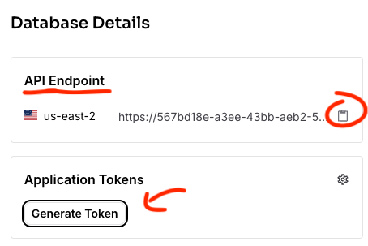

# 🧠 Modernize Your App with AI: A Hands-On Workshop

## 🎯 Workshop Goal

Ready to transform a standard web application into an AI-powered powerhouse? In this hands-on workshop, you'll learn how to leverage the cutting-edge capabilities of **DataStax Astra DB's vector search** and the intuitive **Langflow visual builder** to add sophisticated AI-driven search features to a Node.js product catalog application.

We'll start with a basic product catalog app and iteratively enhance its search functionality:
1.  Implement **keyword-based filtering** by category and tags using Astra DB's Data API.
2.  Introduce **semantic vector search** using `$vectorize` to find products based on meaning.
3.  Combine the best of both worlds with **hybrid search** using the `$hybrid` operator.
4.  Abstract the complex search logic into a **Langflow flow** and call it via its API for ultimate flexibility.

By the end of this workshop, you'll have practical experience using serverless vector databases and low-code AI flow builders to create modern, intelligent applications. Let's get building!

## 🛠️ Prerequisites

This workshop assumes you have access to:
1.  A [GitHub account](https://github.com) (ensure it's set to public if you want to sign up for Astra DB via GitHub).

During the course, you'll gain access to the following by signing up for free:
1.  [DataStax Astra DB](https://astra.datastax.com): Our powerful, serverless vector database.
2.  [OpenAI account](https://platform.openai.com/signup): Needed for generating embeddings (we'll use their API).
    -   *Alternatively, workshop-specific OpenAI API keys might be provided.*

Follow the steps below and securely note down your **Astra DB API Endpoint**, **Astra DB Application Token**, and **OpenAI API Key**. We'll configure them shortly.

### 1. Sign up for Astra DB

Get your free-forever, serverless vector database:
*   Go to [astra.datastax.com](https://astra.datastax.com).
*   Sign up or log in (using GitHub is easy!).
*   Click `Databases` -> `Create Database`.
*   Select `Serverless (Vector)`, choose a Cloud Provider/Region, and name your database (e.g., `agentic-ai`).

    

*   Wait a few minutes for provisioning.
*   On the database dashboard, find and copy your **API Endpoint** (under Database details). Keep this safe!
*   Click `Generate Token`. Choose the "Database Administrator" role for simplicity in this workshop. Give the token a name (e.g., `agentic-ai-token`).
*   Click `Generate`. **Immediately copy the Application Token** (it starts with `AstraCS:...`). This token is shown only once, so save it securely!

    

### 2. Sign up for OpenAI

We need OpenAI because our data loading scripts use it to generate the vector embeddings for product descriptions.
*   Create an [OpenAI account](https://platform.openai.com/signup) or [sign in](https://platform.openai.com/login).
*   Navigate to the [API key page](https://platform.openai.com/account/api-keys).
*   Click `+ Create new secret key`, optionally name it, and copy the generated **API Key**. Save it securely.

    

### 3. ⚡️ Launch the Workshop Environment in GitHub Codespaces

Let's use GitHub Codespaces for a seamless development experience. It sets up everything you need in the cloud, including all dependencies from our pre-built Docker image.

1.  **Fork the Template Repository:** First, create your own copy of the workshop repository so you can make changes.
    *   Navigate to the main workshop repository page: [https://github.com/difli/KineticConstructs](https://github.com/difli/KineticConstructs).
    *   Click the `Use this template` button (usually near the top right) and select `Create a new repository`.

     *<- Placeholder: Add correct image path*

2.  **Configure Your New Repository:**
    *   Select your GitHub account as the owner.
    *   Give your repository a name (e.g., `my-kinetic-constructs-workshop`).
    *   **Crucially, ensure `Include all branches` is checked.** This is important because the starting code is on the `workshop` branch.
    *   Optionally add a description.
    *   Click `Create repository`.

     *<- Placeholder: Add correct image path*

3.  **Navigate to Your New Repository:** Go to the main page of the repository you just created under your account.

4.  **Switch to the `workshop` branch:** Use the branch selector dropdown (usually says `main`) and select the `workshop` branch.

5.  **Create Codespace:** Click the green `<> Code` button, navigate to the `Codespaces` tab, and click `Create codespace on workshop`.

    

6.  **Patience is a Virtue:** Wait a few minutes while Codespaces pulls the pre-built Docker image and sets up your cloud-based development environment. Grab that coffee! ☕️

7.  **Configure Secrets:** Once the Codespace loads (you'll see VS Code in your browser), we need to provide the API keys you saved. The `postCreateCommand` in our devcontainer setup automatically copies `.env.example` to `.env` if `.env` doesn't exist.
    *   Find the `.env` file in the file explorer on the left (it should have been created automatically). If not, create it by copying `.env.example`.
    *   Edit `.env` and replace the placeholder values with your actual `OPENAI_API_KEY`, `ASTRA_DB_API_ENDPOINT`, and `ASTRA_DB_APPLICATION_TOKEN`.
    *   **Important:** The `.gitignore` file is set up to prevent committing your `.env` file with secrets.

    Your `.env` file should look something like this:
    ```dotenv
    # OpenAI Settings
    OPENAI_API_KEY="sk-..."

    # Astra DB Settings
    ASTRA_DB_API_ENDPOINT="https://YOUR_ENDPOINT.apps.astra.datastax.com"
    ASTRA_DB_APPLICATION_TOKEN="AstraCS:..."

    # --- Langflow Configuration ---
    # Directory for logs, database, etc. Needs to be writable by the user running langflow.
    LANGFLOW_CONFIG_DIR="/workspaces/KineticConstructs/.langflow_config" 
    # Adjust '/workspaces/KineticConstructs' if your repo name differs significantly in the path

    # Specifies the database file location within the config dir
    # Note the four slashes for an absolute path with sqlite:///
    LANGFLOW_DATABASE_URL="sqlite:////workspaces/KineticConstructs/.langflow_config/langflow.db" 
    # Adjust '/workspaces/KineticConstructs' if needed

    # Explicitly set the log file path
    LANGFLOW_LOG_FILE="/workspaces/KineticConstructs/.langflow_config/langflow.log" 
    # Adjust '/workspaces/KineticConstructs' if needed
    ```
    *(Note: I added comments about adjusting the path if the repo name causes the workspace root to be different from `/workspaces/KineticConstructs`)*

8.  **Load Data into Astra DB:** Let's populate your database with sample product data. Open a terminal in your Codespace (Terminal -> New Terminal or Ctrl+`).
    ```bash
    cd creation-assets
    python load_products_astra.py
    python load_documents_astra.py
    cd ..
    ```
    These scripts use the credentials from your `.env` file to connect to Astra DB and create/populate the `products` and `documents` collections. Wait for both scripts to complete. You might see some output indicating the collections are being created and data is being loaded.

    [SCREENSHOT: Terminal showing successful output of data loading scripts]

## 🚀 Running the Application (Initial State)

With setup complete, let's run the Node.js web server. We'll start with the final version (`server_2.js` or `server.js` as they implement the same hybrid search) just to ensure the basic app structure works, but we'll focus on the *search functionality iteratively* in the next sections.

In the Codespace terminal:
```bash
node server_2.js # Or node server.js
```
You should see output indicating the server is running, likely on port 3000. Codespaces should automatically detect this and show a pop-up allowing you to "Open in Browser". If not, navigate to the `PORTS` tab in the terminal panel, find port 3000, and click the globe icon (Open in Browser).

You should see the product catalog web page with search and filtering options.

[SCREENSHOT: Basic product catalog web application running]

🎉 **Congrats! You've finished the setup and have the application running.** Now, let's dive into how the different search features are implemented.

*(Press Ctrl+C in the terminal to stop the server before proceeding to the next steps).*\

## 📦 Workshop Follow-Along

### Iteration 1: Filtering by Category and Tag (`server_0.js`)

Our first step focuses on basic filtering using Astra DB's Data API. This allows users to narrow down products based on metadata like `family`, `product_type`, and `tags`.

**How it Works:**
We use the `@datastax/astra-db-ts` client library. The `collection.find()` method accepts a `filter` object using MongoDB-like query operators.

**Code Highlights (`server_0.js` - `/search` route):**

1.  **Building the Filter Object:** We dynamically create the `filter` based on the URL query parameters.
    ```javascript
    // Snippet from server_0.js /search route
    const requestedFamily = req.query.family;
    const requestedType = req.query.type;
    let requestedTags = req.query.tag || [];
    if (typeof requestedTags === 'string') requestedTags = [requestedTags];

    const filterConditions = [];
    if (requestedFamily) {
        const familyTypeFilter = { family: requestedFamily };
        if (requestedType) {
            familyTypeFilter.product_type = requestedType;
        }
        filterConditions.push(familyTypeFilter);
    }
    if (requestedTags.length > 0) {
        // Use $all to match products containing ALL selected tags
        filterConditions.push({ tags: { $all: requestedTags } });
    }

    let filter = {};
    if (filterConditions.length > 1) {
        filter = { $and: filterConditions }; // Combine multiple conditions
    } else if (filterConditions.length === 1) {
        filter = filterConditions[0];
    }
    ```

2.  **Executing the Find Query:** We pass the constructed `filter` to `productCollection.find()`. The second argument (options) is empty for this iteration as we aren't sorting or limiting in a special way yet.
    ```javascript
    // Snippet from server_0.js /search route
    console.log(`Querying products with filter: ${JSON.stringify(filter)}`);
    const cursor = await productCollection.find(filter, {}); // Just filtering
    products = await cursor.toArray();
    console.log(`find returned ${products.length} results.`);
    ```

**Try it Out:**

Run the first iteration of the server:
```bash
node server_0.js
```
Open the application in your browser. Use the sidebar filters for "Family", "Product Type", and "Tags". Observe how the product list updates based on your selections. Check the terminal logs in Codespaces to see the `filter` object being constructed.

[SCREENSHOT: Application showing category/tag filters and filtered results using server_0.js]

Stop the server (Ctrl+C).

### Iteration 2: Semantic Vector Search (`server_1.js` with `$vectorize`)

Now, let's add the magic of semantic search! Instead of exact matches, we'll find products based on the *meaning* of the user's query.

**How it Works:**
*   We leverage the `$vector` field (containing OpenAI embeddings of product descriptions) created during data loading.
*   We use Astra DB's `$vectorize` operator within the `sort` option of the `find` command. This tells Astra DB to take the user's raw text query, convert it into a vector using the *same model configured for the collection* (OpenAI's `text-embedding-ada-002` in this case), and then find the documents whose `$vector` field is most similar (closest in vector space) to that query vector.

**Code Highlights (`server_1.js` - `/search` route):**

1.  **Adding the `$vectorize` Sort Option:** When a text query (`req.query.q`) is present, we add the `sort` option to the `find` command's options object.
    ```javascript
    // Snippet from server_1.js /search route
    const queryText = req.query.q; // Text search query

    // ... build filter object as in server_0.js ...

    // --- Build Options Object ---
    const options = {};
    if (queryText) {
        console.log(`Adding vector search options for: \"${queryText}\"`);
        options.limit = 25; // Limit results
        options.sort = { $vectorize: queryText }; // Key change: Use $vectorize!
        // options.includeSimilarity = true; // Optionally include similarity score
    }

    // --- Single Find Call ---
    console.log(`Querying products with filter: ${JSON.stringify(filter)} and options: ${JSON.stringify(options)}`);
    const cursor = await productCollection.find(filter, options); // Pass filter and options
    products = await cursor.toArray();
    ```
    *   Crucially, our Node.js code *doesn't* need an OpenAI client here; Astra DB handles the query vectorization via `$vectorize`.

**Try it Out:**

Run the second iteration:
```bash
node server_1.js
```
Open the application. Use the main search box. Try searching for concepts:
*   "something warm for winter"
*   "stay dry in the rain"
*   "gear for climbing mountains"
Notice how the results relate semantically, even if the exact words aren't in the product description! Combine this with the filters.

[SCREENSHOT: Application showing vector search results for a conceptual query using server_1.js]

Stop the server (Ctrl+C).

### Iteration 3: Hybrid Search (`server_2.js` with `$hybrid`)

Vector search is powerful for understanding intent, but sometimes keywords are essential (like brand names or specific features). Hybrid search combines semantic relevance with keyword matching.

**How it Works:**
*   Astra DB provides the `$hybrid` operator in the `sort` option. This instructs the database to perform *both* a vector similarity search (like `$vectorize`) *and* a traditional keyword relevance search (BM25) over indexed text fields.
*   It then intelligently blends the scores from both search types to produce a ranked list where results are both semantically similar *and* contain relevant keywords.
*   The `@datastax/astra-db-ts` client offers a convenient `findAndRerank` method designed specifically for `$hybrid` search, which returns results ordered by the combined relevance score.

**Code Highlights (`server_2.js` - `/search` route):**

1.  **Using `$hybrid` and `findAndRerank`:** When a text query is present, we use `$hybrid` in the `sort` options and call the `findAndRerank` method.
    ```javascript
    // Snippet from server_2.js /search route
    const queryText = req.query.q; // Text search query

    // ... build filter object as before ...

    // --- Build Options Object ---
    const options = {};
    if (queryText) {
        console.log(`Adding hybrid search options for: \"${queryText}\"`);
        options.limit = 25;
        options.sort = { $hybrid: queryText }; // Key change: Use $hybrid!
    }

    // --- Single Find Call ---
    console.log(`Querying products with filter: ${JSON.stringify(filter)} and options: ${JSON.stringify(options)}`);

    if (queryText) {
        // Key change: Use findAndRerank for hybrid search
        const cursor = await productCollection.findAndRerank(filter, options);
        const rankedResults = await cursor.toArray(); // Array of RankedResult objects
        // Extract the original document from each result
        products = rankedResults.map(result => result.document);
        console.log(`findAndRerank returned ${products.length} results.`);
    } else {
        // Fallback to regular find if no query text (filtering only)
        const cursor = await productCollection.find(filter, options);
        products = await cursor.toArray();
        console.log(`find returned ${products.length} results.`);
    }
    ```

**Try it Out:**

Run the third iteration:
```bash
node server_2.js
```
Open the application. Try searches combining concepts and keywords:
*   "waterproof gore-tex hiking boots"
*   "lightweight tent for backpacking"
*   "comfortable fleece jacket"
Compare the results to the pure vector search. You should see a better blend of relevance and keyword matching.

[SCREENSHOT: Application showing hybrid search results using server_2.js]

Stop the server (Ctrl+C).

### Iteration 4: Simplify with Langflow!

Implementing the search logic directly in Node.js is effective, but Langflow provides a visual, low-code/no-code way to build, manage, test, and deploy these AI flows as API endpoints. This separates the AI logic from the main application code, making both easier to maintain and update.

**How it Works:**
*   We visually build the hybrid search logic in Langflow using its drag-and-drop interface and Astra DB components.
*   Langflow hosts this flow and provides a REST API endpoint.
*   Our Node.js application (`server_3.js` - which you will create) simply calls this Langflow API endpoint with the user's query and displays the results returned by the flow.

**Steps:**

1.  **Start Langflow:**
    Ensure Langflow is running. In your Codespace terminal:
    ```bash
    langflow run --env-file .env
    ```
    Open Langflow in your browser using the URL provided in the `PORTS` tab (likely port 7860).

    [SCREENSHOT: Langflow UI loading in the browser]

2.  **Build the Hybrid Search Flow:**
    *   Inside Langflow, click "New Project" or navigate to create a new flow.
    *   **Add Components:** From the sidebar, find and drag these components onto the canvas:
        *   `Utilities` -> `TextInput`: This will be our query input. Click the component and rename its `Name` field (under Code) to `query_text` (this defines the input field for the API).
        *   `Retrievers` -> `AstraDBRetriever`: This component handles the Astra DB interaction.
        *   `Outputs` -> `ChatOutput`: To visualize the results within Langflow.
    *   **Configure `AstraDBRetriever`:**
        *   **API Endpoint:** Paste your Astra DB API Endpoint.
        *   **Token:** Paste your Astra DB Application Token (`AstraCS:...`).
        *   **Keyspace:** Enter `default_keyspace` (or your keyspace name if different).
        *   **Collection Name:** Enter `products` (or your collection name).
        *   **Embedding:** Select `OpenAIEmbeddings`.
        *   **OpenAI API Key:** Langflow should automatically pick this up from your `.env` file (as it's running in the same environment). If not, you might need to configure it here or as a Langflow global variable.
        *   **Search Type:** Select **`Hybrid`**.
    *   **Connect Components:** Drag a connection from the output handle of `TextInput` to the `Input Value` input handle of `AstraDBRetriever`. Drag a connection from the output handle of `AstraDBRetriever` to the input handle of `ChatOutput`.
    *   **Save:** Click the Save icon and give your flow a name (e.g., "Hybrid Product Search").

    [SCREENSHOT: Langflow canvas showing the components connected: TextInput -> AstraDBRetriever (Hybrid configured) -> ChatOutput]

3.  **Get the API Endpoint:**
    *   With your flow open, click the API button (usually looks like `<>`) in the Langflow toolbar.
    *   A modal will appear showing example `curl` commands and Python snippets. Note the **endpoint URL** (it includes a unique Flow ID) and the expected **JSON input structure** (it should use the `input_value` key matching your `TextInput` name).

    [SCREENSHOT: Langflow UI showing the API endpoint details modal for the flow]

4.  **Implement `server_3.js` (Manual Step for You):**
    Now, you'll create `server_3.js`. The easiest way is to copy `server_2.js` and modify the `/search` route handler. Instead of calling `productCollection.findAndRerank`, you'll use `fetch` (or another HTTP client like `axios`) to make a POST request to the Langflow API endpoint you noted.

    **Conceptual Code Snippet (to adapt for `server_3.js`):**
    ```javascript
    // Example using fetch (or axios) in server_3.js /search route
    import fetch from 'node-fetch'; // Add 'node-fetch' to package.json if needed, or use built-in fetch

    async function searchWithLangflow(query) {
      // IMPORTANT: Replace with YOUR actual Langflow URL and Flow ID from the Langflow UI
      const langflowApiUrl = 'http://127.0.0.1:7860/api/v1/run/YOUR_FLOW_ID'; 

      // Match the 'Name' field of the TextInput component in your Langflow flow
      const requestBody = {
        input_value: query, 
        stream: false, // Get the full result at once
        // output_type: "chat" // Adjust based on your output component if needed
      };

      console.log(`Calling Langflow API: ${langflowApiUrl} with query: ${query}`);

      try {
        const response = await fetch(langflowApiUrl, {
          method: 'POST',
          headers: { 'Content-Type': 'application/json' },
          body: JSON.stringify(requestBody),
        });

        if (!response.ok) {
          const errorBody = await response.text();
          throw new Error(`Langflow API Error (${response.status}): ${errorBody}`);
        }

        const result = await response.json();
        console.log("Raw Langflow Result:", JSON.stringify(result, null, 2));

        // --- Process the Langflow Result ---
        // This is CRITICAL and depends heavily on the exact structure Langflow returns.
        // You MUST inspect the "Raw Langflow Result" logged above to figure out
        // how to extract the product documents. It might be nested deeply.
        // Example *GUESS* (likely needs adjustment):
        let products = [];
        if (result?.outputs?.[0]?.outputs?.[0]?.results?.documents) {
            // Assuming the retriever output contains a 'documents' list
             products = result.outputs[0].outputs[0].results.documents.map(doc => doc.metadata); // Extract metadata if product data is there
             console.log(`Extracted ${products.length} products from Langflow response.`);
        } else {
            console.warn("Could not find expected product data in Langflow response structure.");
        }
        return products;
        // --- End Processing ---

      } catch (error) {
        console.error("Error calling Langflow API:", error);
        return [];
      }
    }

    // In your /search route handler:
    // ... (get queryText, requestedFamily, etc.) ...
    if (queryText) {
        products = await searchWithLangflow(queryText);
        // NOTE: Filtering by family/tags must now be handled *within* the Langflow flow
        // itself (e.g., by adding filter inputs to the flow and connecting them
        // to the AstraDBRetriever) or applied *after* getting results from Langflow.
        // This current example only sends the text query.
    } else {
        // Fallback to direct DB call for non-text search (filtering only)
        const cursor = await productCollection.find(filter, {});
        products = await cursor.toArray();
    }
    // ... (rest of rendering logic) ...
    ```
    *   **Crucial:** You *must* inspect the actual JSON response from your Langflow API call (use `console.log`) to figure out how to correctly parse the product results. The example above is just a guess.
    *   You'll also need to decide how to handle filtering (category/tags) – either add inputs to your Langflow flow or filter the results *after* they come back from Langflow.

5.  **Try it Out:**
    *   Make sure Langflow is still running.
    *   Create and save your `server_3.js` file based on the snippet and `server_2.js`.
    *   Run the final iteration: `node server_3.js`.
    *   Open the application and perform searches. Debug the Langflow API call and result parsing until you see the search results correctly populated from your Langflow flow!

    [SCREENSHOT: Application showing search results fetched via Langflow API call from server_3.js]

## 🎉 Workshop Complete!

Congratulations! You've successfully modernized a Node.js application by integrating powerful AI search capabilities using DataStax Astra DB and Langflow.

You've learned how to:
*   Set up Astra DB as a vector database.
*   Use the Astra DB Data API for filtering and vector/hybrid search (`$vectorize`, `$hybrid`) in Node.js.
*   Understand the concepts of embeddings and semantic search.
*   Build an AI search flow visually using Langflow.
*   Integrate a Node.js application with a Langflow API endpoint.

This demonstrates how you can rapidly build and deploy sophisticated AI features with modern, developer-friendly tools.

**Next Steps:**
*   Enhance your Langflow flow (add filtering, try different components).
*   Dive deeper into the Astra DB Data API documentation.
*   Experiment with different embedding models.
*   Deploy your application and Langflow flow to production!

Thanks for participating!