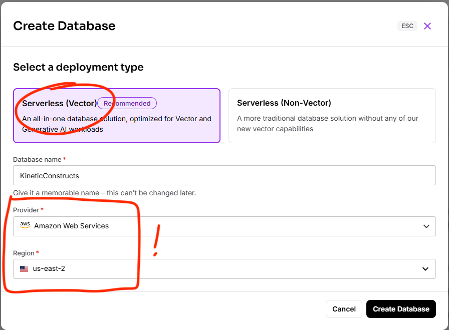
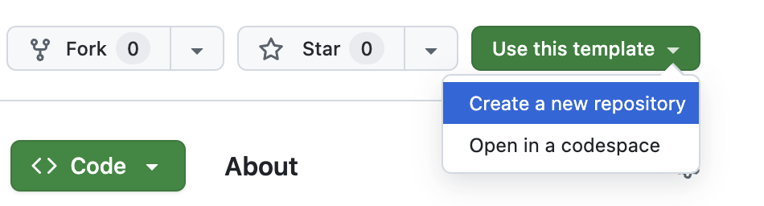

# 🧠 Modernize Your App with AI: A Hands-On Workshop 

## 🎯 Goal of the workshop
Learn how to ...

By the end of this workshop, you'll have ... 

## 🛠️ Prerequisites
This workshop assumes you have access to:
1. [A Github account](https://github.com)

During the course, you'll gain access to the following by signing up for free:
1. [DataStax Astra DB](https://astra.datastax.com) (you can sign up through your **public** Github account)
2. [OpenAI account](https://platform.openai.com/signup) (you can sign up through your Github account)
    - *Alternatively we'll provide some OpenAI API keys to use for this workshop*

Follow the below steps and note down the **Astra DB API Endpoint**, **Astra DB ApplicationToken** and **Open
AI API Key** as we'll need them later on.

### Sign up for Astra DB
Make sure you have a vector-capable Astra database (get one for free at [astra.datastax.com](https://astra.d
atastax.com))
- Sign up or log in
- Click `Databases` and click `Create Database` 
- Select `Serverless (Vector)`, type a database name, i.e. `agentic-ai` and select a Cloud Provider and Regi
on of choice

    

- Wait a few minutes for it to provision
- Note down the **API Endpoint** which can be found in the right pane underneath *Database details*.
- Click on `Generate Token` and give it a name, i.e. `agentic-ai-token` and click `Generate`. Now click on t
he copy button and paste the **Application Token** somewhere for later use

    

### Sign up for OpenAI
- Create an [OpenAI account](https://platform.openai.com/signup) or [sign in](https://platform.openai.com/lo
gin).
- Navigate to the [API key page](https://platform.openai.com/account/api-keys) and create a new **Secret Key
**, optionally naming the key.
    - *Alternatively we'll provide some OpenAI API keys to use for this workshop*

    

### ⚡️ Open this tutorial on Github Codespaces
To make life easier, we'll use the awesome Github Codespace functionality. Github offers you a completely in
tegrated developer experience and resources to get started quickly. How?

1. Open the [workshop repository](https://github.com/difli/KineticConstruct) repository
2. Click on `Use this template`->`Ceate new repository` as follows:

    

3. Now select your github account and name the new repository.  **ensure you select: Include all branches**.
 Ideally also set the description. Click `Create repository`

    

4. Cool! You just created a copy in your own Gihub account! Now let's switch to the **workshop** branch. Cli
ck `Create codespace on workshop` as follows:

    

5. Wait a few minutes and get a cup of coffee until your codespace is configured.

6. Configure the secrets as follows:

- Copy `.env.example` to `.env`
- Edit `.env` and provide the required variables `OPENAI_API_KEY`, `ASTRA_DB_API_ENDPOINT` and `ASTRA_DB_APP
LICATION_TOKEN`

6. Now we can run Langflow as follows in the terminal window:

    ```bash
    uv run langflow run --env-file .env
    ```

    This starts Langflow and opens a port to your Codespace in the cloud. In case you loose track of the URL
 to Langflow, just click on `PORTS` in the terminal window.

🎉 Congrats! You finished the set-up part of the workshop. Now for the fun part!

## 📦 Workshop follow-along

### Search by Category and Tag

This initial version demonstrates basic product search using DataStax Astra DB's Data API. The code shows ho
w to search our ConstructoBots, LogicLeaps, and other product lines using MongoDB-style queries.

For example, you can search for:
- All ConstructoBots wheeled robots: `{ family: "ConstructoBots", product_type: "Wheeled Robots" }`
- Products with specific tags: `{ tags: { $all: ["coding", "python"] } }`
- Combine both: `{ $and: [{ family: "ConstructoBots" }, { tags: { $all: ["coding", "python"] } }] }`

Here's the key search code:

```javascript
const filterConditions = [];

if (requestedFamily) {
    const familyTypeFilter = { family: requestedFamily };
    if (requestedType) {
        familyTypeFilter.product_type = requestedType;
    }
    filterConditions.push(familyTypeFilter);
}

if (requestedTags.length > 0) {
    filterConditions.push({ tags: { $all: requestedTags } });
}

let filter = {};
if (filterConditions.length > 1) {
    filter = { $and: filterConditions };
} else if (filterConditions.length === 1) {
    filter = filterConditions[0];
}

let options = {};

const cursor = await productCollection.find(filter, options);
const products = await cursor.toArray();
```

To see this in action, run:

```bash
node server.js
```

### Search using Vectorize

In this version, we enhance our search capabilities by adding vector search using Astra DB's `$vectorize` op
erator. The beauty of this enhancement is that we don't need to modify our existing filter logic - we simply
 add vector search as an additional option.

Here are the only changes needed:

```javascript
// Add this line to get the search query from the request
const semanticQuery = req.query.q;

// Add these lines before the find() call
if (semanticQuery) {        
    options.sort = { $vectorize: semanticQuery };
    options.limit = 25;
}
```

We also update the search page to enable semantic search by enabling a property in the template context:

```javascript
res.render('search', {
    // ... other properties ...
    semanticSearchEnabled: true,
    keywordSearchEnabled: false
});
```

This means you can now:
- Search semantically (e.g., "robot that can walk and balance")
- Combine semantic search with filters (e.g., "python coding robot" in ConstructoBots)
- Fall back to regular search when no query is provided

The vector search automatically converts your text query into embeddings and finds the most semantically sim
ilar products, making it much easier for users to find what they're looking for using natural language.

To see this in action, run:

```bash
node server_1.js
```

### Search with Hybrid Search

In `server_2.js`, we enhance our search capabilities by implementing hybrid search, which combines both sema
ntic vector search and lexical search. This provides more accurate and relevant results by considering both
semantic meaning and keyword matches.

The key changes from the previous version are:

```javascript
// We switch from $vectorize to $hybrid in our sort options
if (semanticQuery) {
    options.sort = { $hybrid: semanticQuery };
    options.limit = 25;
}

// Use findAndRerank for text queries, regular find otherwise
if (semanticQuery) {
    const cursor = await productCollection.findAndRerank(filter, options);
    const rankedResults = await cursor.toArray();
    products = rankedResults.map(result => result.document);
} else {
    const cursor = await productCollection.find(filter, options);
    products = await cursor.toArray();
}
```

This enhancement means:
- When users search with text (e.g., "python coding robot"), the system now considers both:
  - Semantic similarity (understanding the meaning of the query)
  - Keyword relevance (matching specific terms in product descriptions)
- The results are automatically reranked to show the most relevant products first
- You can still combine this with filters (family, type, tags) for precise results
- When no search text is provided, it falls back to regular filtered search

To see this in action, run:

```bash
node server_2.js
```

### Hybrid Search with Explict Keywords

In `server_3.js`, we take hybrid search a step further by allowing users to specify both semantic and keywor
d search criteria independently. This gives users more control over how their search is performed.

The key changes include:

```javascript
// Get both semantic and keyword queries from the request
const semanticQuery = req.query.q;
const keywordQuery = req.query.keyword;

// Configure hybrid search with both vector and lexical components, and just vector if no keywords
if (semanticQuery) {
    if (keywordQuery) {
        options.sort = { $hybrid: { $vectorize: semanticQuery, $lexical: keywordQuery } };
    } else {
        options.sort = { $vectorize: semanticQuery };
    }
    options.limit = 25;
}

// And then use hybrid search if we have both semantic and keywords, otherwise
// fall back to the standard search
if (semanticQuery && keywordQuery) {
    const cursor = await productCollection.findAndRerank(filter, options);
    const rankedResults = await cursor.toArray();
    products = rankedResults.map(result => result.document);
    console.log(`findAndRerank returned ${products.length} results.`);
} else {
    const cursor = await productCollection.find(filter, options);
    products = await cursor.toArray();
    console.log(`find returned ${products.length} results.`);
}
```

The UI has been updated to support this with separate input fields for semantic and keyword search:

```javascript
res.render('search', {
    // ... other properties ...
    semanticSearchEnabled: true,
    keywordSearchEnabled: true
});
```

This advanced implementation provides:
- Independent control over semantic and keyword search components
- The ability to use semantic search alone, keyword search alone, or both together
- More precise control over search results by combining different search strategies
- Automatic reranking of results based on both semantic and keyword relevance
- Continued support for all filtering capabilities (family, type, tags)


To see this in action, run:

```bash
node server_3.js
``` 